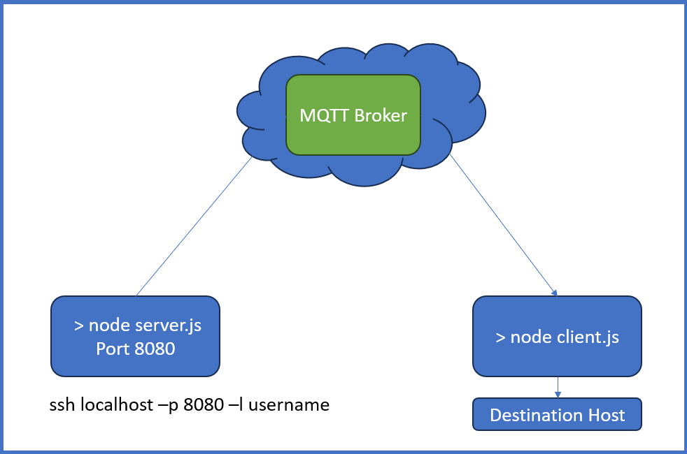

# MQTT Back Door Man

It opens a TCP/IP door from one host to another over a MQTT topic. Use TLS for communication (as SSH does) and apply topic security features of your broker. Please evaluate and consider the possible security impacts by using this! 

